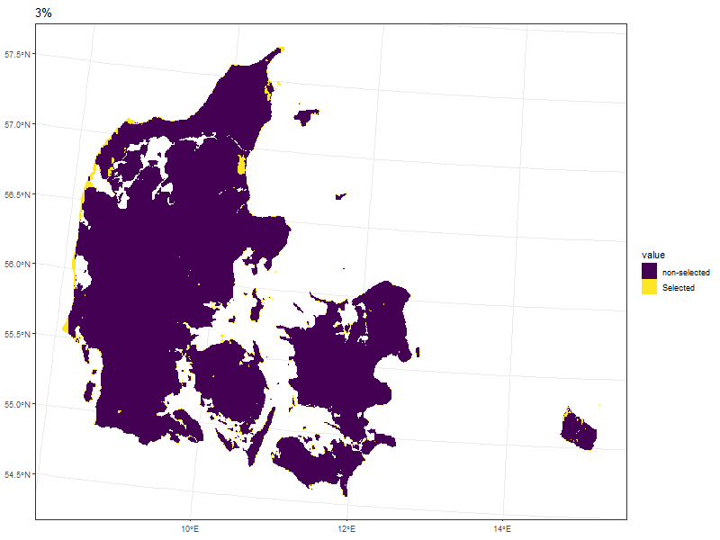

```{r setup, include=FALSE}
knitr::opts_chunk$set(echo = FALSE, warning = FALSE, message = FALSE, tidy = TRUE, cache = TRUE)
library(tidyverse)
library(raster)
library(terra)
library(sf)
library(ggrepel)
library(kableExtra)
options("kableExtra.html.bsTable" = T)
```

## Methods

* Using prioritizr for optimization
* two approaches
  + Minimum cost to approach goals
  + Maximum gain given a certain budget (better to get to target areas)
* `r nrow(readRDS("Natives.rds")) ` species as target features

# Biodiversity

## Data for Denmark

* From BIEN, we looked for all the presences of species present in Denmark
  + Native: `r nrow(readRDS("Natives.rds")) `
  + Invasive: 208 (more introduced species have also been modeled)
* Model current and 4 future scenarios


## Concensus (Example)

* When current and future ranges are aligned


```{r, cache = T}
PresentCons <- "O:/Nat_Ecoinformatics/C_Write/_User/DerekCorcoran_au687614/Prioritization/Projection_PresentBIN/Taraxacum_interveniens.tif"


All <- list.files("O:/Nat_Ecoinformatics/C_Write/_User/DerekCorcoran_au687614/Prioritization/Projection_FutureBIN/", pattern = "Taraxacum_interveniens", full.names = T)

Consensus <- "O:/Nat_Ecoinformatics/C_Write/_User/DerekCorcoran_au687614/Prioritization/Concensus/Taraxacum_interveniens.tif"

All <- c(PresentCons, All, Consensus) %>% purrr::map(raster::raster) %>% 
  purrr::reduce(stack)

names(All) <- c("Present","GFDLESM2M", "HGEA", "inm4", "IPCL", "Concensus")
plot(All, colNA = "black")

```

## Concensus richness

```{r cons, cache=T}

DF <- readRDS("Natives.rds") %>% 
  dplyr::filter(!is.na(Area_Present), !is.na(Area_Consenus), Area_Consenus > 0)

Links <- paste0("O:/Nat_Ecoinformatics/C_Write/_User/DerekCorcoran_au687614/Prioritization/", DF$Concensus)

Richness <- Links %>% 
  purrr::map(terra::rast) %>% 
  purrr::reduce(`+`)

terra::writeRaster(Richness, "ConcensusRichness.tif", overwrite = T)
```

```{r}
Richness <- raster::raster("CurrentRichness.tif")
ConcensuRichness <- raster::raster("ConcensusRichness.tif")
Both <- raster::stack(Richness, ConcensuRichness)
names(Both) <- c("Present", "Concensus")
plot(Both, colNA = "black")
```

* Present richness vs concensus richness
* Better options with migrations, artscore, and other metrics
* Other taxa

# Human dimension

## Agriculture

* Naidoo and Iwamura (2007)
* Based on potential crop and livestock production
* Does not consider climate change (We can do better)

```{r}
Naidoo <- raster::raster("O:/Nat_Ecoinformatics/C_Write/_User/DerekCorcoran_au687614/Prioritization/Naidoo.tif")
plot(Naidoo, colNA = "black")
```

## Human footprint

```{r HFP, cache = T}
HFP <- raster::raster("O:/Nat_Ecoinformatics/C_Write/_User/DerekCorcoran_au687614/HumanFootprint/HumanFootPrintDKN.tif") %>% 
  raster::projectRaster(crs = "+proj=aea +lat_0=49.0601837 +lon_0=17.7539063 +lat_1=37.0553505 +lat_2=61.0650168 +x_0=0 +y_0=0 +datum=WGS84 +units=m +no_defs") %>% 
  resample(Naidoo)

Humans <- raster::stack(HFP, Naidoo)
names(Humans) <- c("Footprint", "Agriculture")
```

* Copenhagen shows how different they are

```{r}
plot(Humans, colNA = "black")
```

# Prioritization

## Naive prioritization

* Only take into account species (10% coverage)

```{r}
Results <- readRDS("O:/Nat_Ecoinformatics/C_Write/_User/DerekCorcoran_au687614/Prioritization/Sols.rds")
```

```{r firstResults}
Flat <- raster::stack(ConcensuRichness, Results[[1]])
names(Flat) <- c("Richness", "Selected")

plot(Flat, colNA = "black")
```

## Add Agriculture

* Add Agriculture as cost (min cost)

```{r AgroResults}
Agro <- raster::stack(Naidoo, Results[[2]])
names(Agro) <- c("Agriculture", "Selected")

plot(Agro, colNA = "black")
```

## We dont start from scratch

* Start with protected areas, eliminate cities (HFP)

```{r HFPResults}
Priors <- raster::stack(HFP, Results[[4]])
names(Priors) <- c("Priors", "Selected")

plot(Priors, colNA = "black")
```


## Using weights and different budgets

```{r}

```

## closest to 10 and 30%

```{r}
DF <- read_csv("O:/Nat_Ecoinformatics/C_Write/_User/DerekCorcoran_au687614/Prioritization/Sols.csv")
Temp13 <- raster(paste0("O:/Nat_Ecoinformatics/C_Write/_User/DerekCorcoran_au687614/Prioritization/MaxUtilitySols/Solution_", DF$Budget[3], ".tif"))

Temp21 <- raster(paste0("O:/Nat_Ecoinformatics/C_Write/_User/DerekCorcoran_au687614/Prioritization/MaxUtilitySols/Solution_", DF$Budget[5], ".tif"))

Temp <- stack(Temp13, Temp21)

names(Temp) <- c("Protected_13", "Protected_21")
plot(Temp, colNA = "black")
```

# Other things to add

## Prioritization doesn't have to be about species

* Add ecosystem services as features to be preserved
* Add other needs as cosntrains (Carbon stock among others)

