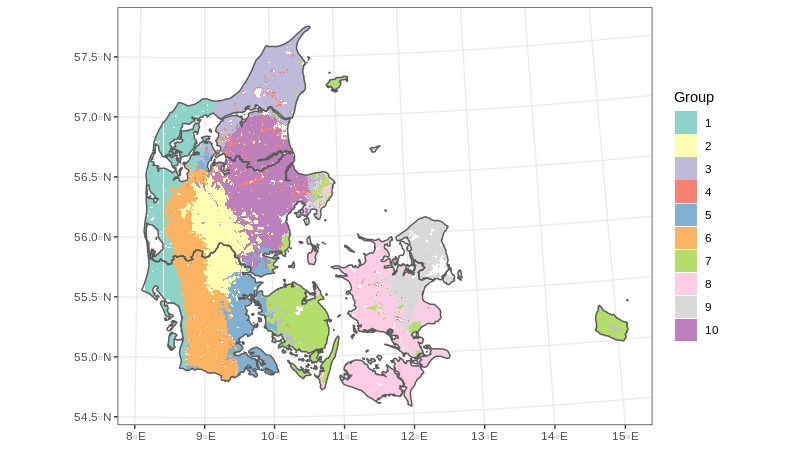

```{r setup, include=FALSE}
knitr::opts_chunk$set(echo = FALSE, warning = FALSE, message = FALSE, tidy = TRUE, cache = TRUE)
library(tidyverse)
library(raster)
library(terra)
library(sf)
library(ggrepel)
library(kableExtra)
library(GeoStratR)
options("kableExtra.html.bsTable" = T)

table_scaled <- readRDS("table_scaled.rds")

circle <- read_rds("circle.rds")

table_diff_unscaled <- readRDS("table_diff_unscaled.rds") %>% 
  dplyr::mutate(bio01 = bio01/10, Type = case_when(GCM == "Present" ~ "Present",
                                                   GCM == "Ensemble" ~ "Ensemble",
                                                   TRUE ~ "GCM"))

Selected <- read_csv("Selected.csv")

#table_diff_unscaled$GCM <- table_scaled$GCM
data(Bios)

a <- Stratify(Bios)

```

# Stratification of Denmark

## Separate into classes

```{r, out.width= "80%"}

```

## How to decide on number of classes

```{r nClasses}
ggplot(a$Results, aes(x = n_groups, y = calinski)) + geom_path() + geom_point() + geom_vline(xintercept = 4, lty = 2) + theme_bw() + labs(x = "Number of groups", y = "Calinski index")
```


## Drivers of climate change

* Climate change
* Habitat degradation
* **Explotation**
* **Pollution (Nitrogen, Phosphorus, Air pollution)**
* Invasive species

# Climate change

## Climate change

* Four different future scenarios
* Climate change velocity
* Extreme conditions


## Compared to current conditions

```{r}
ggplot(table_diff_unscaled, aes(x = bio01, y = bio12)) + geom_point(aes(color = Type)) + geom_text_repel(aes(label = GCM)) + theme_bw() + labs(x = "Anual temperature", y = "Total precipitation")
```

## Comparison among futures

```{r}
ggplot(table_scaled, aes(x = x_axis, y = y_axis)) + geom_point(aes(color = Within_circle)) + geom_path(data = circle, aes(x= x, y = y)) + geom_text_repel(aes(label = GCM)) + geom_vline(xintercept = 0, lty = 2) + geom_hline(yintercept = 0, lty = 2) + coord_equal() + theme_minimal() + labs(x = "Scaled anual temperature", y = "Scaled total precipitation") + annotate("label", x = 2, y = 2, label = "Warmer-wetter") + annotate("label", x = 2, y = -2, label = "Warmer-drier") + annotate("label", x = -2, y = 2, label = "Colder-wetter") + annotate("label", x = -2, y = -2, label = "Colder-drier")
```

## Selected GCMs

* Based of four corners (Fajardo *et al.*, 2020)

```{r}
table_scaled <- table_scaled %>% 
  dplyr::filter(GCM %in% Selected$Name)

ggplot(table_scaled, aes(x = x_axis, y = y_axis)) + geom_point() + geom_path(data = circle, aes(x= x, y = y)) + geom_text_repel(aes(label = GCM)) + geom_vline(xintercept = 0, lty = 2) + geom_hline(yintercept = 0, lty = 2) + coord_equal() + theme_minimal() + labs(x = "Scaled anual temperature", y = "Scaled total precipitation")  + annotate("label", x = 2, y = 2, label = "Warmer-wetter") + annotate("label", x = 2, y = -2, label = "Warmer-drier") + annotate("label", x = -2, y = 2, label = "Colder-wetter") + annotate("label", x = -2, y = -2, label = "Colder-drier")
```

* We are working on higher resolution climate for Denmark

## Example of climate change Velocity

* Kms per year

```{r}
Test <- raster::raster("O:/Nat_Ecoinformatics/C_Write/_User/DerekCorcoran_au687614/ClimateChangeVelocity/GFDLESM2M.tif")
plot(Test, colNA = "black")
```


# Biodiversity and invasive species

## Data for Denmark

* From BIEN, we looked for all the presences of species present in Denmark
  + Native: `r nrow(readRDS("Natives.rds")) `
  + Introduced: 208 (more introduced species have also been modeled)
* Model current and 4 future scenarios

## Invasive Species

```{r invasiverichness}
PresentIntro <- readRDS("O:/Nat_Ecoinformatics/C_Write/_User/DerekCorcoran_au687614/Prioritization/Introduced.rds")

Links <- paste0("O:/Nat_Ecoinformatics/C_Write/_User/DerekCorcoran_au687614/Prioritization/", PresentIntro$Present)

InvasiveRichness <- Links %>% 
  purrr::map(terra::rast) %>% 
  purrr::reduce(`+`)

terra::writeRaster(InvasiveRichness, "InvasiveRichness.tif", overwrite = T)
```
```{r}
InvasiveRichness <- raster::raster("InvasiveRichness.tif")
plot(InvasiveRichness, colNA = "black")
```


## Native species current richness

```{r Richness, cache = T}

Present <- readRDS("Natives.rds") %>% 
  dplyr::filter(!is.na(Area_Present), Area_Present != 0)

Rarity <- 1/Present$Area_Present
Rarity <- Rarity/max(Rarity)

Links <- paste0("O:/Nat_Ecoinformatics/C_Write/_User/DerekCorcoran_au687614/Prioritization/", Present$Present)

Richness <- Links %>% 
  purrr::map(terra::rast) %>% 
  purrr::reduce(`+`)

terra::writeRaster(Richness, "CurrentRichness.tif", overwrite = T)

Rare <- list()

for(i in 1:length(Rarity)){
  Temp <- terra::rast(Links[i])
  Rare[[i]] <- Temp*Rarity[i]
}

Rare <- Rare %>% 
    purrr::reduce(`+`)

terra::writeRaster(Rare, "CurrentRarity.tif", overwrite = T)
```
```{r}
Richness <- raster::raster("CurrentRichness.tif")
plot(Richness, colNA = "black")
```


## Rarity

```{r}
Rarity <- raster::raster("CurrentRarity.tif")
plot(log(Rarity), colNA = "black")
```

## Concensus (Example)

* When current and future ranges are aligned


```{r, cache = T}
PresentCons <- "O:/Nat_Ecoinformatics/C_Write/_User/DerekCorcoran_au687614/Prioritization/Projection_PresentBIN/Taraxacum_interveniens.tif"


All <- list.files("O:/Nat_Ecoinformatics/C_Write/_User/DerekCorcoran_au687614/Prioritization/Projection_FutureBIN/", pattern = "Taraxacum_interveniens", full.names = T)

Consensus <- "O:/Nat_Ecoinformatics/C_Write/_User/DerekCorcoran_au687614/Prioritization/Concensus/Taraxacum_interveniens.tif"

All <- c(PresentCons, All, Consensus) %>% purrr::map(raster::raster) %>% 
  purrr::reduce(stack)

names(All) <- c("Present","GFDLESM2M", "HGEA", "inm4", "IPCL", "Concensus")
plot(All, colNA = "black")

```

## Concensus richness

```{r cons, cache=T}

DF <- readRDS("Natives.rds") %>% 
  dplyr::filter(!is.na(Area_Present), !is.na(Area_Consenus), Area_Consenus > 0)

Links <- paste0("O:/Nat_Ecoinformatics/C_Write/_User/DerekCorcoran_au687614/Prioritization/", DF$Concensus)

Richness <- Links %>% 
  purrr::map(terra::rast) %>% 
  purrr::reduce(`+`)

terra::writeRaster(Richness, "ConcensusRichness.tif", overwrite = T)
```

```{r}
Richness <- raster::raster("CurrentRichness.tif")
ConcensuRichness <- raster::raster("ConcensusRichness.tif")
Both <- raster::stack(Richness, ConcensuRichness)
names(Both) <- c("Present", "Concensus")
plot(Both, colNA = "black")
```

* Present richness vs concensus richness
* Better options with migrations, artscore, and other metrics
* Other taxa

# Habitat degradation

## Agriculture

* Naidoo and Iwamura (2007)
* Based on potential crop and livestock production
* Does not consider climate change (We can do better)

```{r}
Naidoo <- raster::raster("O:/Nat_Ecoinformatics/C_Write/_User/DerekCorcoran_au687614/Prioritization/Naidoo.tif")
plot(Naidoo, colNA = "black")
```

## Human footprint

```{r HFP, cache = T}
HFP <- raster::raster("O:/Nat_Ecoinformatics/C_Write/_User/DerekCorcoran_au687614/HumanFootprint/HumanFootPrintDKN.tif") %>% 
  raster::projectRaster(crs = "+proj=aea +lat_0=49.0601837 +lon_0=17.7539063 +lat_1=37.0553505 +lat_2=61.0650168 +x_0=0 +y_0=0 +datum=WGS84 +units=m +no_defs") %>% 
  resample(Naidoo)

Humans <- raster::stack(HFP, Naidoo)
names(Humans) <- c("Footprint", "Agriculture")
```

* Copenhagen shows how different they are

```{r}
plot(Humans, colNA = "black")
```


# Prioritization

## Minimum Cost

$${\mathit{Minimize} \space \sum_{i = 1}^{I} x_i c_i \\}$$

* Every $i$ is a cell, where $c_i$ is the cost for each cell. 
* $x_i$ is a decision of 0 not to use in prioritization and 1 to use in a prioritization

## Naive prioritization

* Only take into account species (10% coverage)

```{r}
Results <- readRDS("O:/Nat_Ecoinformatics/C_Write/_User/DerekCorcoran_au687614/Prioritization/Sols.rds")
```

```{r firstResults}
Flat <- raster::stack(ConcensuRichness, Results[[1]])
names(Flat) <- c("Richness", "Selected")

plot(Flat, colNA = "black")
```

## Add Agriculture

* Add Agriculture as cost (min cost)

```{r AgroResults}
Agro <- raster::stack(Naidoo, Results[[2]])
names(Agro) <- c("Agriculture", "Selected")

plot(Agro, colNA = "black")
```

## We dont start from scratch

* Start with protected areas, eliminate cities (HFP)

```{r HFPResults}
Priors <- raster::stack(HFP, Results[[4]])
names(Priors) <- c("Priors", "Selected")

plot(Priors, colNA = "black")
```

## Maximum utility

$${\mathit{Maximize} \space \sum_{i = 1}^{I} -s \space c_i \space x_i + \sum_{j = 1}^{J} a_j w_j \\}$$

* where $c_i$ is the cost of cell $i$
* $x_i$ is the decision to use (1) or not use (0) cell i in the final solution
* $a_j$ is the amount of feature $j$ in cell $i$ and $w_j$ is the weight of each feature
* $s$ is a scaling factor used to shrink the costs so that the problem will return a cheapest solution 

Subject to

$$\sum_{i = 1}^{I} x_i c_i \leq B$$

* Where B is a budget (don't need to set fixed boudaries)

## Using weights and different budgets

```{r}
knitr::include_graphics("animation.gif")
```

## closest to 10 and 30%

```{r}
DF <- read_csv("O:/Nat_Ecoinformatics/C_Write/_User/DerekCorcoran_au687614/Prioritization/Sols.csv")
Temp13 <- raster(paste0("O:/Nat_Ecoinformatics/C_Write/_User/DerekCorcoran_au687614/Prioritization/MaxUtilitySols/Solution_", DF$Budget[3], ".tif"))

Temp21 <- raster(paste0("O:/Nat_Ecoinformatics/C_Write/_User/DerekCorcoran_au687614/Prioritization/MaxUtilitySols/Solution_", DF$Budget[5], ".tif"))

Temp <- stack(Temp13, Temp21)

names(Temp) <- c("Protected_13", "Protected_21")
plot(Temp, colNA = "black")
```

# Desicions to make

## Objective function

* We should probably test different objective functions 
  + Minimum cost
  + Maximum utility
  + Minimum largest shortfall

## Features

* Ecosystem services
* Microbiota diversity and anssambles

## Constrains

* Carbon stock
* Pesticide reduction
* Food needs (i.e. 55,000 Tons of livestock)


## Need to build some projections

* Agriculture and land use Best guess for the future
  + Projected yieald with climate change
  + Ideas on how to manage land use and check (could use ideal vs projected scenarios)
  + More local projections
* Carbons stock, acumulated per cell per time-slice
  